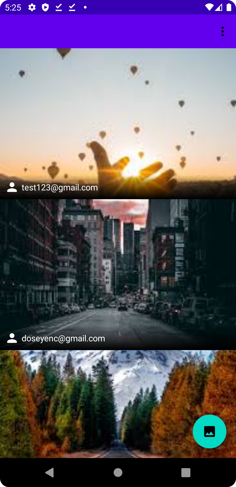

# PhotoSharing
 

<h3>Tech Stack<h3>
<ul>
  
  <li><a href="https://firebase.google.com/products/auth?gclsrc=ds&gclsrc=ds&gclid=COzOgfGglPkCFd5EHQkdlkEATA" target="_blank">Firebase Authentication</a></li>

  <li><a href="https://firebase.google.com/docs/firestore" target="_blank">Firebase FireStore</a></li>
  
  <li><a href="https://developer.android.com/topic/libraries/view-binding" target="_blank">ViewBinding</a></li>
  
  <li><a href="https://developer.android.com/guide/navigation" target="_blank">Navigation</a></li>
  
  <li><a href="https://github.com/bumptech/glide" target="_blank">Glide</a></li>
  
 </ul>

 

 

 

